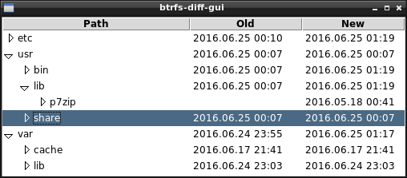

# btrfs-diff-gui
Tool for comparing two btrfs snapshots graphically.

## Usage

```bash
btrfs-diff-gui /snapshots/oldest-snapshot /snapshots/newest-snapshot
```


You can use advanced `--skip-equal` option as well.

## License
Published under the liberal terms of the BSD License, see the [LICENSE](LICENSE) file.
